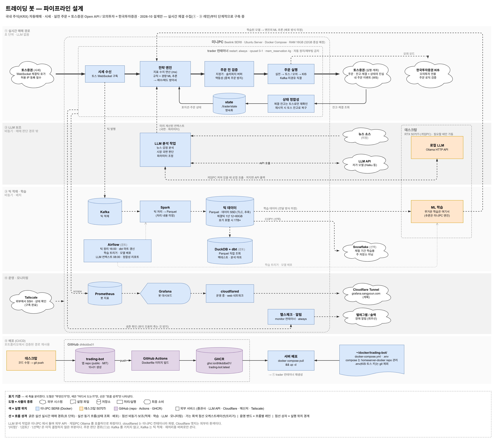

# trading-bot

홈서버(미니PC)에서 상시 구동할 **국내 주식(KRX) 자동매매 봇**입니다.
돈이 걸리는 주문 기능은 마지막에 붙이고, **실시간 체결 데이터를 받아 쌓는 수집 파이프라인부터** 단계적으로 만들고 있습니다.

> 🚧 **진행 중** — 3단계(WebSocket 실시간 체결 수신)와 4단계(Kafka 적재)를 진행하고 있습니다. 실전 주문 기능은 아직 없습니다.

## 아키텍처



| 레인 | 하는 일 | 상태 |
|---|---|---|
| ① 실시간 매매 | 토스 WebSocket 체결 → 전략 엔진 → 주문 전 검증 → 주문 실행. 체결 · 잔고는 토스로만 재확인 | 수신 · 구독 ✅ / 엔진 · 주문 미착수 |
| ② LLM 보조 | 뉴스 · 시장 국면 분석을 **비동기**로 미리 계산해 엔진에는 컨텍스트로만 전달 | 설계 |
| ③ 틱 적재 · 학습 | 체결틱 → Kafka → Parquet. ML 학습은 데스크탑(GPU), 추론은 미니PC | 로컬 Kafka 기동 ✅ / 적재 진행 중 |
| ④ 운영 · 모니터링 | Prometheus · Grafana · 헬스체크 알림 | 설계 |
| ⑤ 배포 | GitHub Actions → GHCR → 서버 `docker compose pull` | 다른 프로젝트에서 검증된 경로 재사용 예정 |

`(미정)` · `(검토)` · `(선택)` 표시는 아직 결정하지 않은 부분입니다.

## 설계 원칙

- **시세 · 주문 · 계좌는 토스증권 하나로.** 시세와 주문을 서로 다른 증권사에서 받으면 체결가 괴리, 종목코드 매핑 같은 문제가 생깁니다. 토스 공식 문서에는 모의투자 언급이 없어서, 주문 로직 검증만 **한국투자증권 모의투자**로 합니다.
- **주문 판단 경로에는 LLM 도 Kafka 도 넣지 않습니다.** LLM 응답은 초 단위로 느리고, Kafka 장애가 매매를 멈추게 하면 안 됩니다. Kafka 는 틱 적재 · 재처리(replay)용 버퍼로만 씁니다.
- **원본부터 남깁니다.** 받은 체결 메시지는 파싱하기 전 원본을 그대로 보존합니다. 파싱 로직이 틀려도 원본에서 다시 만들 수 있고, 틱 단위 과거 데이터는 나중에 다시 받을 수 없어 일찍 쌓을수록 자산이 됩니다.
- **토큰은 저장해서 재사용합니다.** 토스는 클라이언트당 유효한 토큰이 1개뿐이라(새로 발급하면 이전 토큰은 무효), 실행할 때마다 발급하면 다른 프로세스의 연결이 끊깁니다.
- **조용히 틀리지 않습니다.** 모든 요청에 `timeout` 과 응답 상태 확인을 넣고, 필수 설정값이 없으면 그 자리에서 에러를 냅니다.

## 진행 상황

| 단계 | 내용 | 상태 |
|---|---|---|
| 1 | 개발 환경 — venv · `.env` 분리 · 키 커밋 차단 | ✅ |
| 2 | 토스 토큰 발급(캐시) → REST 현재가 조회 | ✅ |
| 3 | WebSocket 실시간 체결 구독 | 🔄 구독 ✅ · 장중 체결 수신 확인 예정 |
| 4 | Kafka 경유 적재 — 수신기가 produce → consumer 가 원본 JSONL 저장 | 🔄 로컬 Kafka(KRaft) 기동 ✅ |
| 5 | 서버 컨테이너로 평일 장중 상시 수집 | ⏳ |
| 이후 | 전략 엔진 → 모의 주문 검증 → 실주문(소액) → 모니터링 | ⏳ |

## 기술 스택

| 구분 | 사용 중 | 계획 · 검토 |
|---|---|---|
| 언어 · 라이브러리 | Python 3.12 · requests · websockets · python-dotenv | confluent-kafka |
| 데이터 | Kafka 4.3 (KRaft · 로컬 Docker, 연동 진행 중) | Spark · Parquet · DuckDB + dbt(검토) |
| 오케스트레이션 | — | Airflow(검토) |
| 인프라 | Docker | Docker Compose · GitHub Actions · GHCR · Prometheus · Grafana |
| 외부 API | 토스증권 Open API (REST · WebSocket) | 한국투자증권 Open API (모의투자) |

## 구조

```
trading-bot/
├── src/
│   └── exchange/
│       ├── toss.py          # 토큰 발급(24시간 캐시 · 401 이면 1회 재발급) · 현재가 조회
│       └── web_socket.py    # 실시간 체결 구독 · 60초마다 PING 으로 연결 유지
├── docs/architecture.png    # 파이프라인 설계도
├── .env.example             # 필요한 키 이름 (값 없음)
└── requirements.txt
```

## 실행

```powershell
# 1) 가상환경 + 라이브러리  (Linux/macOS 는 source .venv/bin/activate)
python -m venv .venv
.\.venv\Scripts\Activate.ps1
pip install -r requirements.txt

# 2) 키 설정 — .env.example 을 복사해 값을 채운다 (.env 는 git 에서 제외)
Copy-Item .env.example .env
#    토스증권 WTS > 설정 > Open API 에서 client_id · client_secret 발급,
#    실행하는 PC 의 공인 IP 를 '허용 IP' 로 등록해야 호출된다

# 3) 현재가 조회
python -m src.exchange.toss 005930 000660

# 4) 실시간 체결 구독 — 장중에 체결이 들어온다 (Ctrl+C 로 종료)
python -m src.exchange.web_socket 005930 000660

# 5) (4단계) 로컬 Kafka
docker run -d --name kafka -p 9092:9092 apache/kafka:latest
```

`src` 안의 모듈끼리 불러오기 때문에 파일 경로가 아니라 **repo 루트에서 `python -m`** 으로 실행합니다.

## 보안

- 키는 `.env` 에만 두고 git 에 올리지 않습니다(`.gitignore`). `.env.example` 에는 키 이름만 있습니다.
- 로컬 pre-commit 훅으로 키 값이 들어간 변경은 커밋되지 않게 막습니다.
- 토스 API 는 등록한 허용 IP 에서만 호출됩니다.

## 주의

개인 학습 · 포트폴리오용 저장소입니다. 투자 권유가 아니며, 이 코드를 사용해 생긴 손실의 책임은 사용자에게 있습니다.

## License

MIT
